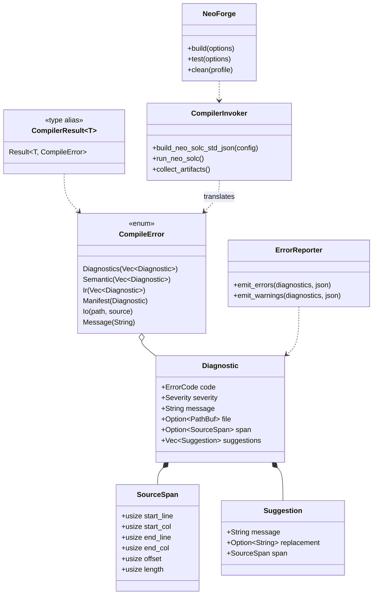
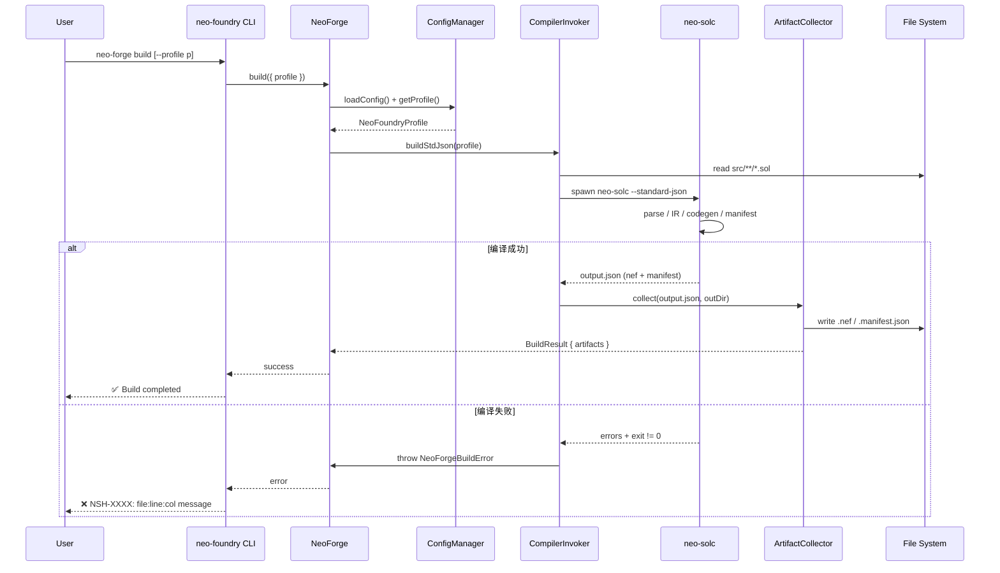
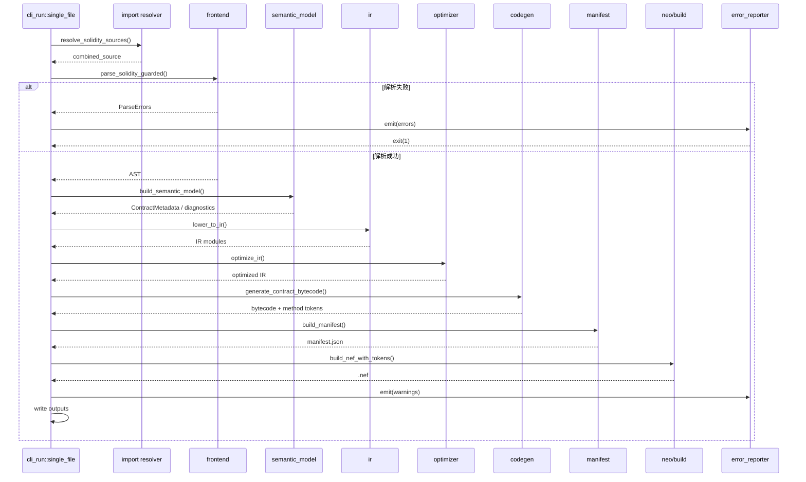

# Neo Solidity 编译器与 DevPack 技术加固 — 系统架构设计

> 项目简称：Neo Solidity Hardening（NSH）  
> 基线版本：v0.30.2  
> 设计目标：支撑 PRD 中 P0 落地、P1 规划、P2 路线图，并明确模块边界、接口与任务依赖。

---

## 1. 总体实现方案与技术选型

### 1.1 核心策略

| 维度 | 策略 |
|------|------|
| **错误处理** | 建立统一的 `Diagnostic` / `CompilerError` 体系；关键路径的 `unwrap/expect` 全部替换为 `Result` 传播或 `fatal_error!`；CLI 层统一收口退出码。 |
| **版本一致性** | 在 Rust 与 TypeScript 两侧共享同一个 Solidity 版本范围常量 `[0.8.19, 0.8.28)`；模板、配置文件、示例统一从该常量派生。 |
| **文件拆分** | 对剩余 >800 行的核心文件做“外科式”拆分，保持 git 历史（`git mv` + 小步 edit），拆分后单文件职责单一。 |
| **neo-forge build** | 不重复实现编译器，而是在 `neo-foundry` 中新增 `CompilerInvoker`，调用 `neo-solc` CLI / Standard JSON 完成编译，并收集 `.nef` / `.manifest.json`。 |
| **依赖控制** | P0 尽量不引入新依赖，复用现有 `clap/serde/thiserror/solang-parser`；P1 再评估 `miette`/`ariadne` 用于诊断格式化。 |

### 1.2 技术选型（P0）

| 范围 | 选型 | 理由 |
|------|------|------|
| 错误模型 | `thiserror` + 自定义 `Diagnostic` 结构 | 已有依赖，零新增成本；可向后兼容 `miette`。 |
| CLI 参数 | `clap` derive | 已是当前选型，保持稳定。 |
| 配置解析 | 工具链使用 TOML（`@iarna/toml` 为可选），Rust 侧用 `toml` crate 仅在需要时引入 | P0-4 先完成标准路径，不引入新解析器。 |
| 产物输出 | `serde_json` | 已有依赖，用于 manifest / standard JSON。 |
| 构建调用 | `child_process.spawn`（TS）调用 `neo-solc` | 避免跨语言绑定，复用已有二进制。 |

### 1.3 模块边界调整

- **新增 `src/diagnostics/`**：承载 `Diagnostic`、`ErrorCode`、`SourceSpan`、`Severity`，以及 `Report` 格式化器。当前 `solidity::Diagnostic`、`ir::IrDiagnostic`、`frontend::ParseDiagnostic` 将逐步收敛到该模块，P0 先统一接口，P1 再彻底替换内部表示。
- **新增 `src/cli/cli_parts/error_reporter.rs`**：替代分散在 `cli_run`、`cli_output`、`cli_diagnostics` 中的错误打印逻辑，使所有用户可见错误都带 `NSH-XXXX` 错误码与源位置。
- **新增 `tooling/packages/neo-foundry/src/compiler-invoker.ts`**：封装 `neo-solc` 调用、standard JSON 构造、产物收集与错误转发。
- **新增 `tooling/packages/neo-foundry/src/artifact-collector.ts`**：按 `neo-foundry.toml` 的 `out` 目录结构整理 `.nef` 与 `.manifest.json`。
- **不拆分为独立 binary crate**：保留 `neo-solc` 与 `neo-test` 两个 bin，但 `neo-forge` 作为 TypeScript 工具链入口，不新增 Rust bin。

---

## 2. 新增/修改文件清单

### 2.1 Rust 编译器本体

#### 新增文件

| 相对路径 | 用途 |
|----------|------|
| `src/diagnostics/mod.rs` | 诊断模块入口与 `Severity` 枚举 |
| `src/diagnostics/diagnostic.rs` | 统一 `Diagnostic` 结构（source file / span / message / code / suggestions） |
| `src/diagnostics/error_code.rs` | `NSH-XXXX` 错误码定义与分类 |
| `src/diagnostics/report.rs` | 诊断格式化输出（终端 + JSON） |
| `src/cli/cli_parts/error_reporter.rs` | CLI 错误收口与报告打印 |
| `src/frontend/frontend_error.rs` | 前端/parser 阶段结构化错误（P0 先把 `unwrap` 转 Result） |
| `src/ir/ir_error.rs` | IR  lowering 阶段结构化错误 |
| `src/manifest/manifest_error.rs` | manifest 生成阶段结构化错误 |
| `src/codegen/codegen_error.rs` | bytecode 生成阶段结构化错误 |
| `src/optimizer/optimizer_error.rs` | optimizer 阶段结构化错误（P1） |
| `tests/error_regression.rs` | P0 错误处理回归测试（panic 拦截、退出码、错误码） |
| `scripts/check_file_length.sh` | CI 检查 src 下 >800 行文件 |
| `scripts/check_unwrap.sh` | CI 审计 `unwrap/expect` 使用（允许 SAFETY 注释） |

#### 修改文件

| 相对路径 | 修改内容 |
|----------|----------|
| `src/cli/cli_parts/cli_run/single_file.rs` | 将 `fatal_error!` 调用统一转 `CompileError`；移除直接 `std::process::exit` |
| `src/cli/cli_parts/cli_run/standard_json.rs` | 同上，统一错误报告 |
| `src/cli/cli_parts/cli_output.rs` | 使用 `error_reporter` 输出诊断 |
| `src/cli/cli_parts/cli_diagnostics.rs` | 合并格式化逻辑到 `src/diagnostics/report.rs` |
| `src/cli/cli_parts/cli_compile/compile.rs` | 将 `compile_contracts` 返回 `Result<Vec<CompilationArtifacts>, CompileError>` |
| `src/cli/mod.rs` | 暴露 `CompilerError` / `Diagnostic` 类型 |
| `src/frontend/frontend_guarded_parse.rs` | parser 错误全部以 `ParseDiagnostic` 返回 |
| `src/frontend/frontend_ir.rs` | 前端转换错误以 `Diagnostic` 返回 |
| `src/ir/ir_build/*.rs` | 将关键 `unwrap` 替换为 `Result` 传播 |
| `src/ir/ir_expressions/dispatch/binary_u256_softarith.rs` | 拆分大文件 |
| `src/ir/ir_expressions/arrays.rs` | 拆分大文件 |
| `src/ir/ir_expressions/calls/low_level.rs` | 拆分大文件 |
| `src/ir/ir_expressions/calls/member_calls.rs` | 拆分大文件 |
| `src/ir/ir_expressions/calls/builtins/abi_encode.rs` | 拆分大文件 |
| `src/ir/ir_expressions/calls/builtins/abi_decode.rs` | 拆分大文件 |
| `src/ir/ir_context/builtins/resolve.rs` | 拆分大文件 |
| `src/ir/ir_statements/dispatch/return_lower.rs` | 拆分大文件 |
| `src/solidity/solidity_analyse.rs` | 拆分大文件 |
| `src/runtime/execution/execution_impl_part2_native/stdlib.rs` | 拆分大文件（运行时） |
| `src/cli/tests/standard_json/input_errors.rs` | 拆分大文件（测试） |
| `src/cli/tests/metadata/standards.rs` | 拆分大文件（测试） |
| `src/frontend/frontend_parse/semver.rs` | 抽出 `SUPPORTED_SOLIDITY_RANGE` 常量 |
| `Cargo.toml` | 若需要时添加 `toml` / `miette`（P1 再评估） |

### 2.2 TypeScript 工具链

#### 新增文件

| 相对路径 | 用途 |
|----------|------|
| `tooling/packages/neo-foundry/src/compiler-invoker.ts` | 调用 `neo-solc`，生成 Standard JSON，解析输出 |
| `tooling/packages/neo-foundry/src/artifact-collector.ts` | 收集并整理 `.nef` / `.manifest.json` |
| `tooling/packages/neo-foundry/src/build-cache.ts` | 增量编译缓存（文件哈希 -> 产物路径） |
| `tooling/packages/neo-foundry/src/build-error.ts` | `NeoForgeBuildError` 结构，携带源位置与错误码 |
| `tooling/packages/neo-foundry/test/forge-build.test.ts` | `neo-forge build` 集成测试 |
| `tooling/packages/integration-tests/test/neo-forge-build.test.ts` | 端到端：在 scaffold 项目上运行 `neo-forge build` 并检查产物 |

#### 修改文件

| 相对路径 | 修改内容 |
|----------|----------|
| `tooling/packages/neo-foundry/src/forge.ts` | 实现 `NeoForge.build()` |
| `tooling/packages/neo-foundry/src/cli.ts` | 增加 `neo-forge build` 命令 |
| `tooling/packages/neo-foundry/src/config.ts` | 默认 `neoSolc.version` 改为 `0.8.19` 并做范围校验；新增 `solc-version` 常量 |
| `tooling/packages/templates/src/template-engine.ts` | 模板默认 `solcVersion` 从共享常量读取；移除硬编码 `0.8.34` 路径 |
| `tooling/packages/hardhat-solc-neo/src/compiler.ts` | 校验传入版本在 `[0.8.19, 0.8.28)` |
| `tooling/packages/integration-tests/src/scenarios.test.ts` | 补充 neo-forge build 未实现断言改为产物存在断言 |
| `tooling/packages/neo-foundry/package.json` | 增加 `@neo-devpack-solidity/cli-tools` 依赖 |

### 2.3 DevPack 运行时与合约模板

| 相对路径 | 修改内容 |
|----------|----------|
| `devpack/contracts/` 模板 | 统一 `pragma solidity ^0.8.19`；检查是否有 `0.8.34` 残留 |
| `devpack/runtime/` 中 stub 文件 | P0 仅标注 TODO + issue；P1 再补齐 |

---

## 3. 数据结构与接口设计

### 3.1 核心类型

```rust
// src/diagnostics/diagnostic.rs
pub struct Diagnostic {
    pub code: ErrorCode,           // NSH-XXXX
    pub severity: Severity,        // Error / Warning / Info
    pub message: String,
    pub file: Option<PathBuf>,
    pub span: Option<SourceSpan>,  // line / column / offset
    pub suggestions: Vec<Suggestion>,
}

pub struct SourceSpan {
    pub start_line: usize,
    pub start_col: usize,
    pub end_line: usize,
    pub end_col: usize,
    pub offset: usize,
    pub length: usize,
}

pub struct Suggestion {
    pub message: String,
    pub replacement: Option<String>,
    pub span: SourceSpan,
}

pub enum Severity { Error, Warning, Info }

// src/cli/cli_parts/cli_defs.rs
pub enum CompileError {
    Diagnostics(Vec<Diagnostic>),
    Semantic(Vec<Diagnostic>),
    Ir(Vec<Diagnostic>),
    Manifest(Diagnostic),
    ParseErrors(Vec<Diagnostic>),
    Io { path: PathBuf, source: std::io::Error },
    Message(String),
}

pub type CompilerResult<T> = Result<T, CompileError>;
```

### 3.2 模块关系（Mermaid 类图）



### 3.3 接口约定

| 接口 | 位置 | 说明 |
|------|------|------|
| `compile_contracts(input, opts) -> CompilerResult<Vec<CompilationArtifacts>>` | `src/cli/cli_parts/cli_compile/compile.rs` | 核心编译入口，P0 必须返回结构化错误。 |
| `process_standard_json_content(input, path, opts) -> CompilerResult<()>` | `src/cli/standard_json.rs` | Standard JSON 入口，错误通过 `CompileError` 返回。 |
| `Diagnostic::from_parse_error(e, file)` | `src/frontend/frontend_error.rs` | parser 错误转换。 |
| `Diagnostic::from_ir_error(e, file)` | `src/ir/ir_error.rs` | IR 错误转换。 |
| `NeoForge.build(opts)` | `tooling/packages/neo-foundry/src/forge.ts` | 完整实现，非 scaffold。 |
| `CompilerInvoker.invoke(config)` | `tooling/packages/neo-foundry/src/compiler-invoker.ts` | Promise 返回 `BuildResult`。 |

---

## 4. 程序调用流程

### 4.1 `neo-forge build` 端到端流程（Mermaid 时序图）



### 4.2 `neo-solc` 单文件编译流程（Mermaid 时序图）



---

## 5. 有序任务列表

### 5.1 任务依赖总图

```
T1 基础设施与诊断骨架
├── T2 错误处理审计（前端→IR）
│   ├── T3 错误处理审计（codegen→manifest）
│   │   └── T4 错误处理回归测试
├── T5 Solidity 版本一致性（TS + Rust 常量）
│   ├── T6 模板与配置版本清理
│   │   └── T7 模板/配置集成测试
├── T8 核心文件拆分
├── T9 neo-forge build 设计
│   ├── T10 CompilerInvoker 实现
│   │   ├── T11 ArtifactCollector 实现
│   │   └── T12 NeoForge.build 完整实现
│   │       └── T13 neo-forge build 集成测试
└── T14 P0 验收与 CI 加固

P1（独立并行）
├── T15 诊断格式化升级
├── T16 optimizer/codegen 覆盖率审计
├── T17 运行时/库 API 命名与 stub 整理
└── T18 集成测试矩阵

P2（后续迭代）
├── T19 unsafe/TODO 审计
├── T20 性能基准
├── T21 codegen/manifest 产物抽象 crate
├── T22 LSP 初版接口
└── T23 fuzz 测试
```

### 5.2 P0 详细任务

| 编号 | 任务 | 负责人 | 优先级 | 依赖 | 关联 PRD |
|------|------|--------|--------|------|----------|
| T1 | 建立 `src/diagnostics/` 模块：`Diagnostic`、`ErrorCode`、`SourceSpan`、`Severity`、`Report` 格式化；定义 `CompilerResult<T>` | Engineer | P0 | — | P0-1 / P1-3 |
| T2 | 前端与 IR 阶段错误处理审计：将 `frontend`、`frontend_guarded_parse`、`frontend_ir`、`ir_build` 中关键路径 `unwrap/expect` 替换为 `Result` / `Diagnostic` | Engineer | P0 | T1 | P0-1 |
| T3 | codegen、optimizer、manifest 阶段错误处理审计：替换关键 `unwrap/expect`，所有产物生成失败返回 `CompileError` | Engineer | P0 | T2 | P0-1 |
| T4 | 错误处理回归测试：构造非法输入、空合约、超大字面量、错误 import 等场景，断言非 panic 退出并包含 `NSH-XXXX` | QA | P0 | T3 | P0-5 / AC-3 |
| T5 | Solidity 版本范围统一：在 Rust 侧定义 `SUPPORTED_SOLIDITY_RANGE`，在 TS 侧导出共享常量；校验入口版本 | Engineer | P0 | — | P0-2 / AC-4 |
| T6 | 清理模板、配置与示例中的 `0.8.34` 默认值；`neo-foundry.toml` / `hardhat.config` / scaffold 模板统一使用 `0.8.19` 或常量 | Engineer | P0 | T5 | P0-2 |
| T7 | 模板与配置版本一致性集成测试 | QA | P0 | T6 | AC-4 |
| T8 | 拆分剩余 >800 行核心文件：按“职责单一”原则拆分为多个 <=800 行文件；保留 git 历史 | Engineer | P0 | — | P0-3 / AC-6 |
| T9 | `neo-forge build` 设计定稿：输入输出目录、standard JSON 构造、缓存策略、错误转发协议 | Architect | P0 | T5 | P0-4 |
| T10 | 实现 `CompilerInvoker`：生成 standard JSON、spawn `neo-solc`、解析输出、错误转 `NeoForgeBuildError` | Engineer | P0 | T9 | P0-4 |
| T11 | 实现 `ArtifactCollector`：按 `out/` 目录结构写入 `.nef` / `.manifest.json` | Engineer | P0 | T10 | P0-4 |
| T12 | 实现 `NeoForge.build()`：整合配置、源文件发现、增量缓存、调用 invoker、collector | Engineer | P0 | T11 | P0-4 |
| T13 | `neo-forge build` 端到端测试：在 scaffold 项目上运行并断言产物存在 | QA | P0 | T12 | P0-5 / AC-5 |
| T14 | P0 验收与 CI 加固：文件长度检查、unwrap 检查、clippy、doc、测试全绿 | QA / Engineer | P0 | T4/T7/T8/T13 | AC-1 ~ AC-9 |

### 5.3 P1 高层任务

| 编号 | 任务 | 负责人 | 优先级 | 依赖 | 关联 PRD | 入口点 |
|------|------|--------|--------|------|----------|--------|
| T15 | 诊断格式化升级（源码片段、建议修复） | Engineer | P1 | T1/T4 | P1-3 / P1-4 | `src/diagnostics/report.rs` |
| T16 | optimizer / codegen pass 覆盖率审计与边界 case 补充 | Engineer | P1 | T3 | P1-1 | `src/optimizer/`, `src/codegen/` |
| T17 | 运行时/库 API 命名与 stub 整理：统一前缀、标记 experimental | Engineer | P1 | — | P1-2 | `devpack/runtime/` |
| T18 | 集成测试矩阵：不同 Solidity 版本、不同 OS、不同工具链入口 | QA | P1 | T13 | P1-5 | `tooling/packages/integration-tests/` |
| T19 | 引入 `miette`/`ariadne` 评估与替换（可选） | Architect | P1 | T15 | P1-3 / Q3 | `src/diagnostics/` |

### 5.4 P2 路线图

| 编号 | 任务 | 负责人 | 优先级 | 关联 PRD | 说明 |
|------|------|--------|--------|----------|------|
| T20 | unsafe / TODO 审计 | Engineer | P2 | P2-1 | 每个 `unsafe` 加 SAFETY 注释；每个 TODO 关联 issue |
| T21 | 性能基准：>10K 行合约编译时间与内存 | QA | P2 | P2-2 | 新增 `criterion` bench |
| T22 | codegen / manifest 产物抽象为独立 crate | Architect | P2 | P2-3 | 为后续多后端做准备 |
| T23 | VS Code / LSP 初版诊断接口 | Engineer | P2 | P2-4 | 基于 `Diagnostic` 输出 LSP JSON-RPC |
| T24 | parser / IR fuzz 测试 | QA | P2 | P2-5 | 复用现有 `fuzz/` 目录扩展 |

---

## 6. 依赖包列表

### 6.1 Rust 依赖（P0 不新增，P1 可选）

| 名称 | 当前/建议版本 | 用途 | 引入时机 |
|------|---------------|------|----------|
| `clap` | 4.0 | CLI 参数解析 | 已有 |
| `serde` / `serde_json` | 1.0 | 序列化、Standard JSON、manifest | 已有 |
| `thiserror` | 1.0 | 错误枚举 | 已有 |
| `solang-parser` | 0.3.9 | Solidity 解析 | 已有 |
| `stacker` | 0.1 | 递归栈保护 | 已有 |
| `toml` | 0.8 | TOML 配置解析（若 Rust 侧需解析） | P1 按需 |
| `miette` / `ariadne` | 最新 | 高级诊断格式化 | P1 评估后 |
| `criterion` | 0.5 | 性能基准 | P2 |
| `proptest` / `quickcheck` | 1.0 | 模糊测试 | P2 |

### 6.2 TypeScript 依赖（P0 新增/调整）

| 名称 | 版本 | 用途 | 引入时机 |
|------|------|------|----------|
| `@neo-devpack-solidity/cli-tools` | workspace | 复用 CLI 工具 | P0 |
| `@iarna/toml` | 2.5 | TOML 解析（可选） | P0（可选） |
| `chalk` | 已有 | 终端输出 | 已有 |
| `fs-extra` | 已有 | 文件操作 | 已有 |
| `vitest` | 已有 | 测试 | 已有 |

---

## 7. 共享知识与跨文件约定

### 7.1 错误码体系 `NSH-XXXX`

| 前缀 | 范围 | 含义 |
|------|------|------|
| `NSH-0xxx` | 通用 | 输入/CLI/IO 错误 |
| `NSH-1xxx` | 前端/解析 | 语法、版本、import 错误 |
| `NSH-2xxx` | 语义分析 | 类型、可见性、状态可变性错误 |
| `NSH-3xxx` | IR lowering | 不支持的表达式/语句 |
| `NSH-4xxx` | 优化器 | 优化阶段错误 |
| `NSH-5xxx` | codegen | 字节码生成错误 |
| `NSH-6xxx` | manifest | manifest 构造/权限错误 |
| `NSH-7xxx` | 工具链 | neo-forge / hardhat / template 错误 |
| `NSH-9xxx` | 内部 | 不应出现的内部错误，用于替换 `panic` |

### 7.2 `fatal_error!` 使用规则

- **仅允许在 CLI 顶层调用**（`src/cli/cli_parts/cli_run/` 或 `src/main.rs`），用于用户输入错误、IO 失败等不可恢复的外部问题。
- **编译器内部不允许调用 `fatal_error!`**；所有内部错误必须转换为 `CompileError` 并通过 `Result` 传播。
- `fatal_error!` 输出必须包含 `error: ` 前缀与错误码（如 `error: NSH-0001: ...`）。

### 7.3 `unwrap` / `expect` 使用规则

- 关键路径（用户输入、文件解析、IR 转换、codegen、manifest）**禁止**使用 `unwrap`/`expect`。
- 仅在下述场景允许使用，且必须加 `// SAFETY:` 注释说明为何不可能失败：
  - 常量解析（如 `str::parse::<u32>("123")` 已知合法）。
  - 已前置判空的索引（如 `vec.last().unwrap()` 且前面已 `assert!(!vec.is_empty())`）。
  - 测试代码中的 mock 数据。
- 引入 `#[deny(clippy::unwrap_used)]` 逐步启用，P0 先对新增文件启用，P1 全仓启用。

### 7.4 Solidity 版本范围

- 编译器支持：`>=0.8.19 <0.8.28`（本轮维持不变，见 Q1 推荐）。
- Rust 常量：`src/frontend/frontend_parse/semver.rs` 中 `pub const SUPPORTED_SOLIDITY_RANGE: &str = ">=0.8.19 <0.8.28";`。
- TypeScript 常量：`tooling/packages/types/src/compiler.ts` 中导出 `export const SUPPORTED_SOLIDITY_RANGE = ">=0.8.19 <0.8.28";`。
- 所有模板、配置文件、示例均从上述常量派生，避免硬编码。

### 7.5 文件长度约定

- `src/` 下核心实现文件（不含测试、生成文件）必须 <= 800 行。
- 拆分后每个文件职责单一，命名采用 `module_submodule_action.rs` 风格。
- 优先使用 `git mv` 保留历史，再小步修改。

### 7.6 模块可见性约定

- `pub` 仅用于真正的公共 API：`cli::run`、`neo::*`、`opcode`。
- 新增内部模块使用 `pub(crate)`，避免扩大 API 表面积。
- `#[doc(hidden)]` 仅用于历史遗留的内部模块，新模块不再加此属性。

### 7.7 测试约定

- 新增模块单元测试覆盖率 >= 80%。
- 回归测试必须覆盖：错误输入不 panic、错误码存在、源位置存在、退出码非零。
- 集成测试使用临时目录，测试后清理。

---

## 8. PRD 待确认问题 Q1–Q6 推荐决策

| 编号 | 推荐决策 | 理由 |
|------|----------|------|
| **Q1** | **维持 `>=0.8.19 <0.8.28`，不提升到 0.8.28** | 当前 parser 与语义分析已针对 0.8.19–0.8.27 稳定；提升到 0.8.28 需要额外验证 AST/opcode 变化，会阻塞 P0 发布。建议 P2 再评估上限。 |
| **Q2** | **neo-forge 维护独立 `neo-foundry.toml`，但兼容标准 Foundry 字段** | 完全兼容 Foundry 会扩大范围并引入解析复杂度；先以独立配置保证 P0 落地，字段命名与 Foundry 对齐，未来逐步扩展。 |
| **Q3** | **P0 不引入 `miette`/`ariadne`；P1 评估引入** | P0 目标是稳定可用，不应因新库引入额外风险。P1 在 `src/diagnostics/report.rs` 做可插拔格式化器，届时可替换为 `miette`。 |
| **Q4** | **本轮补齐“高频 stub”：ERC20/ERC721 标准库、常用 syscall 封装；低频 stub 标记 experimental 并关联 issue** | 高频 stub 直接影响模板可用性；低频 stub 可后续迭代。需运行时负责人确认具体清单。 |
| **Q5** | **不拆分 `cli` 为独立 binary crate；保留现有 `neo-solc`/`neo-test`，在 `neo-foundry` 中实现 `neo-forge` 入口** | 拆分 crate 会改变构建与发布流程，P0 风险高。先保持单 crate，P2 如支持多后端再拆分。 |
| **Q6** | **性能基准与 fuzz 测试作为 nightly CI 任务，不阻塞 P0/P1 PR** | 这些任务运行时间长、资源消耗大，适合 nightly；P0/P1 只保留单元/集成测试与 clippy。 |

---

## 9. 风险与阻塞项

| 风险 | 影响 | 缓解措施 |
|------|------|----------|
| 剩余 `unwrap` 数量多，替换过程中引入回归 | 中 | 按阶段审计、小步提交、每个替换配回归测试。 |
| `neo-forge build` 依赖 `neo-solc` 标准 JSON 输出格式，若格式不稳定则 TS 侧易碎 | 中 | 在 TS 侧做输出 schema 校验；neo-solc 侧增加标准 JSON 稳定性测试。 |
| 文件拆分影响未完成的 feature branch | 中 | 拆分前通知团队冻结相关文件；使用 `git mv` 减少冲突。 |
| 运行时高频 stub 清单未确认 | 低 | 由运行时负责人（Q4）在 T17 前给出清单，若无法确认则全部标记 experimental。 |
| Q1/Q5 决策与团队预期不一致 | 低 | 本文档已给出推荐，建议 team-lead 在启动实施前确认。 |

---

## 10. 验收检查清单（P0）

- [ ] `cargo build` / `cargo test` 全绿
- [ ] `cargo clippy -- -D warnings` 无告警
- [ ] `cargo doc` 无告警
- [ ] 任意错误 Solidity 输入均产生非零退出码与 `NSH-XXXX` 错误码
- [ ] 工具链模板默认版本在 `[0.8.19, 0.8.28)` 内
- [ ] `neo-forge build` 在示例项目上生成 `.nef` 与 `.manifest.json`
- [ ] `src/` 下不存在 >800 行的核心文件
- [ ] 新增模块单元测试覆盖率 >= 80%
- [ ] CI 增加文件长度与 unwrap 审计脚本

---

*文档版本：v1.0*  
*负责人：Bob (Gao) / software-architect*  
*输出日期：2026-07-04*
